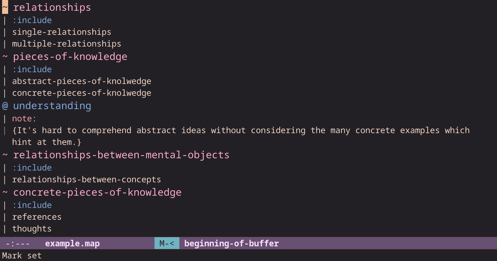

# concept.el

> Plain-text conceptual knowledge editor for Emacs

## Introduction

Conceptual knowledge is an often underappreciated third form knowledge which underlies the more commonly studied relational and procedural forms of knowledge. Those more celebrated forms of knowledge answer the questions:

* What is the case?
* How is it done?

The specifications for these more commonly studied forms of knowledge seem to come from nowhere, residing somehow in our heads. Their underlying genius often lost with the progression of time. After which, they need to be uncovered anew, often by fresh eyes.

Defining effective procedures or coherent relational databases requires firm grounding in domain knowledge. That knowledge is largely conceptual. It doesn't involve calculation, but it captures and organizes patterns in reality which we intuitively map inside our heads into our own verbal understanding.

The conceptual form of knowledge then could be thought of as answering the question:

* What does it mean?

In this computer age, conceptual knowledge is still largely captured in free-form documents such as scientific articles, school textbooks, and blog tutorials. While modern search tools powered by probabilistic models and advanced data structures can help us sort through such documents, this package proposes a radically different way of managing it: through porting it from a linear prose structure into an inherently recursive structure. This new structure closely reflects how we as humans think and learn verbally according to educational psychologies.

The text representation of this format is pretty straightforward. A concept map consists of a text file. For convenience, let's say its a text with a `.map` file extension. Inside of this text file are a series of *ideas*. An idea captures a group of closely related thoughts. There are two kinds of thoughts as far as conceptual knowledge is concerned. There are thoughts which form propositions meaningful inside of some system to thus construct our (often more or less erroneous) understanding, and then there are thoughts which ground our abstract understanding in facts, evidence, and educational materials.

Following this conceptualization of our thinking when we think conceptually, in `concept.el` the representation of every idea has two kinds of components: one which models our abstract conceptual understanding, and the other which facilitates capturing the concrete actionable details which illustrate our more grand notions.

In `concept.el`, every idea starts with a *focus* concept which starts a new idea as well as it's first component: the *relationship block*. This holds all the conceptual relationships relevant to the idea. The focus concept starts with a `~`. It can be thought of as analogous to the subject of a sentence. Then come one or more relationship groups which specify a common relationship, analogous to the verb of a sentence, under which comes one or more data concepts corresponding to the object of a sentence. Thus, a relationship block specifies a group of related conceptual propositions each with their own verbs and objects, but all sharing the same subject.

After the *relationship block* comes zero or more *resource blocks*. These contain one or more attributes which are largely analogous to relationships, except that the data associated with each attribute is often structured more traditionally, if far more briefly.

The example below gives the simplest possible idea. It has one resource block associated with it. It would still be valid if there were none. There doesn't have to be any, but adding them is recommended, especially in situations where there is ambiguity about what idea is being represented. In such an idea as the one expressed below, there is quite a lot of ambiguity!

```
~ things
| :include
| concepts
@ understanding
| note:
| {Concepts are things considered in the mind.}
```

The focus concept (subject) of the idea is on the first line. The relationship (verb) is on the second line. It creates a relationship group which holds the one data concept (object) on the third line. The fourth line starts the only resource block associated with this idea. The attribute is on the fifth line and it's expository data is on the sixth.

The weird and completely miraculous thing is that in practice, we humans hold many hundreds or thousands of ideas in our heads at any given time. So, correspondingly a concept map hold many many ideas combined together. The example concept map below is included as a file in the source code repository for `concept.el`.

```
~ things
| :include
| concepts
| relationships
~ things
| :include
| single-things
| multiple-things
@ understanding
| note:
| {Understanding is based on contrast.}
| idea:
| {SMT}
~ concepts
| :include
| single-concepts
| multiple-concepts
@ understanding
| note:
| {Concepts are things.}
| {Thus, these relationships are implied by SMT.}
| derived-from:
| {SMT}
~ relationships
| :include
| single-relationships
| multiple-relationships
~ concepts
| :include
| subjects
| objects
@ understanding
| note:
| {All ideas have one and only one subject.}
| {The subject is given first and indicated with a tilde: ~.}
@ understanding
| note:
| {In english grammar, a simple sentence has a subject, a verb, and an object.}
| {Here ideas correspond roughly to multiple related simple sentences.}
~ ideas
| :hold
| relationship-blocks
| resource-blocks
~ relationship-blocks
| :hold
| relationship-groups
~ relationships
| :include
| relationships-between-mental-objects
| relationships-between-physical-objects
~ relationships-between-mental-objects
| :include
| relationships-between-concepts
~ relationship-blocks
| :capture
| relationships-between-concepts
~ relationship-groups
| :hold
| multiple-objects
| :share
| single-relationships
@ understanding
| note:
| {Keywords beginning in colons signify the start of a new relationship group.}
~ resource-blocks
| :hold
| attribute-groups
@ understanding
| note:
| {Keywords ending in colons signify the start of a new attribute group.}
~ pieces
| :include
| pieces-of-knowledge
| pieces-of-intuition
~ pieces-of-knowledge
| :include
| abstract-pieces-of-knolwedge
| concrete-pieces-of-knolwedge
@ understanding
| note:
| {It's hard to comprehend abstract ideas without considering the many concrete examples which hint at them.}
~ concrete-pieces-of-knolwedge
| :include
| relevant-concrete-pieces-of-knolwedge
| irrelevant-concrete-pieces-of-knolwedge
~ attribute-groups
| :capture
| concrete-pieces-of-knolwedge
~ concrete-pieces-of-knowledge
| :include
| facts
| references
| thoughts
```

Take your time to read through that and I think you will find that this sort of knowledge capture is quite fundamental. It might seem egregious and unnecessary to be so explicit, but for advanced knowledge work explicitness is commonly recognized as a best practice. This is particularly true in highly multi-disciplinary situations where team members with wildly different skill-sets and expertise collaborate together.

Laying out all the teams conceptual ideas about the problem they are trying to solve can be a revelation for many people working together on a large project. We believe strongly that the best plan can only emerge once everyone on a team gains a comprehensive view of the possibilities before them for solving the problem at hand.

The text format used by `concept.el` is designed to be familiar and comfortable to people with experience writing a little bit of lisp code.  Concepts, resources, relationships, and attribute keywords are intended to be assigned identifiers which look like a readable subset of valid lisp symbols. This should be familiar to most people using Emacs as their editor. Once you accept this restriction on naming, you buy into a set of constraints which facilitate the creation of a bunch of very useful editing tools for making huge concept maps quickly.

These editing tools include:

* a variety of (full and partial) text-completion interfaces
* buffer-wide data validation tools including a parser for concept maps implemented via the `peg` parsing expression grammar library
* hyper-linking to external documents, image files, as well as online documentation
* whole file scanning provided through `imenu`
* document navigation and re-organization system provided through `outline` just like `org` mode in addition to custom tools tailored for concept maps
* a search interface and query language provided through `consult`
* a minibuffer-based editing interface which provides data validation
* data "following" tools which help the user ensure the map is meaningful by grounding it in concrete resources
* an automatically updated network graph representation of the concept map holding all the conceptual relationships stored in the relationship block portions of the buffer

Together they make it feasible to productively develop and explore concept maps with hundreds of thousands of concepts and even more relationships within them.

## Installation

Install via ELPA (eventually!). Run M-x `package-install`. Press `ENTER`. Type `concept`. Press `ENTER`.

## Thinking about concepts

When you think about a particular thing, you use the singular voice: you speak of the cat in the alleyway and the mouse she is chasing. When you think about things in general you use the plural voice, you speak of cats in the act of chasing mice and mice in the act of fleeing cats. When you follow this convention of naming concepts with plural words, you realize that concepts in english have names with three distinct components:

* a classification or categorization component
* a core concept component
* and a definition component

For example, consider the concept:

> abstract-pieces-of-knowledge

This concept can be broken down into:

```
class: abstract
core: pieces
definition: of-knowledge
```

Gaining an intuition for what this concept is about requires first understanding what is meant by knowledge, pieces, and abstraction. These are often best sharpened by finding their opposites or complements. The opposite of abstract is concrete or definite. The opposite of a piece is a part of something, which usually itself contains many smaller pieces at a different scale. Finally, we come to the definition component. Knowledge concerns successful prediction. Ignorance means almost assuredly unsuccessful prediction. Once you think about a concept this way, it's name alone suggests that a whole concept map supports it. We invite you to take a stab it at. We took some time to do this exercise and got a pretty substantial concept map out of it.

```
```

Now, there is much to quibble about and much ambiguity in the above concept map. We certainly see it, but that is the point of concept maps: they give us hooks to organize our thoughts so that they can be productively criticized. It is only through this criticism, preferably open criticism, that our thought improve.

In `concept.el` we encourage you to put the classification piece on the left, the core piece in the middle, and the definition piece on the right. Further, it's better to start with the core plus some definition. Then, once you have your definition, you can added a category which alludes to that definition via and `:name` relationship.

```
~ beings
| :include
| beings-that-die
| beings-that-never-die
~ mortal-beings
| :name
| beings-that-die
~ immortal-beings
| :name
| beings-that-never-die
~ beings
| :include
| immortal-beings
| mortal-beings
```

Redundancy isn't too much of a problem since the main thing is that you understand what you are talking about and that you can gain that understanding by searching through a concept map.

The package provides an implementation of the longest common sub-string algorithm to help build tools for automatically identifying these components. This can be combined with the string-distance procedure and tools which provide you a list of all concepts in the buffer to find likely core concepts. Of course, really discovering this will often require a degree of standardization which is not really possible with Emacs, but should be feasible from a dedicated data analysis environment like R.

## Navigating through concept maps

Concept maps inherit from `outline-minor-mode`. This gives a whole suite of keyboard shortcuts and M-x commands which automatically work with concept maps. Navigating up and down outline heading elements is implemented with `M-n` and `M-p`. In `concept.el`, there are two headings `~` and `@`. Otherwise, you can press `C-<up>` or `C-<down>` to move quickly across additional levels of concept maps including *relationship groups*, *attribute groups* and their corresponding data elements (data concepts) and (expository data). Finally, `C-M-<down>` and `C-M-<up>` let you fly across different elements of the same type.

Did I say 'finally'? I lied. You can also press `C-c C-n` or `C-c C-p` for a more advanced contextual method of navigating through concept maps. These commands have modally defined behavior depending on the value of global variables `concept-last-relationship-group-size-behavior` and `concept-last-attribute-count-behavior` which chooses between the modes `"all"`, `"unique"`, and `"diff"`. These options analyze each idea and compute statistics summarizing interesting aspects of the idea.

This can be useful for finding ideas or resources with certain interesting features. For example, you might want to find ideas with conceptual *relationship blocks* having two relationships instead of one. To do that, place your cursor on the nearest subject line. Then press `C-c C-n`. You will be prompted for the number of objects you want there to be since there is one relationship for each subject-verb-object triple.

If you want to look for ideas with a certain number of relationship groups, press `C-c C-n` from a relationship group line. Similarly, if you want to go forward to the next resource group with a desired number of data lines, place the cursor on a resource line.

Leveraging the tools in `consult.el` can be another very effective way of exploring a concept map. So can `C-s` and `C-r`. Later we will discuss some more powerful block-aware search tools that can be very convenient when the line oriented search tools just don't cut it.

## Editing tools for concept maps

`concept.el` provides a wealth of tools for rapidly entering new ideas and editing existing concept maps to standardize their contents in order to make them as useful a learning tool as possible. Let's start by create a new concept.

Open the `example.map` concept map included in the git repository. Navigate to the beginning of the buffer with `M-<`. Then press `C-o`. This makes a new idea block by creating a new subject line. Type out `stuff`. Then, press `M-i`. This inserts an `:include` relationship and creates an object concept line. Press `M-i` again and it will enter `stuff` again automatically. `M-.` will do the same, while `C-M-.` will add the following subject instead.



The difference between `M-i` and `M-.` is that `M-.` and `C-M-.` will always enter these concepts, while `M-n` does different things depending on where on the line or where in the idea you are. It tries to help you do what you mean, while `M-.` tries to be specific. Enter `cool-stuff` by moving the cursor to the beginning of the concept. This can be done with `C-M-b` which is a built-in editor shortcut for `backward-sexp`. Otherwise you could just type `M-b` repeatedly until you get there. Now type out `cool-`. From hear you can type `M-i` and it will make a new line for you. Now type out `hot-` followed by `M-.` to write `hot-stuff`. Now press `M-o` to make a new subject line filled in automatically with `hot-stuff`. Press `M-i` again and type out `very-` followed by `M-.` to write `very-hot-stuff`.

Now type `M-o` again to make a new subject line automatically filled out with `very-hot-stuff`. Now press `M-i`. Now press `M-1 M-.` to enter `stuff`. Now complete it with `-that-has-many-layers`. Therefore, you have typed out `stuff-that-has-many-layers`. Now press `M-i` followed by `C-.`. `C-.` inserts the last object line instead of the last subject line. As you might imagine, `C-1 C-.` inserts the last word of the last object, just as `M-1 M-.` inserts the last word of the last subject. Note that if you had instead asked for `M--1 M-.` you would have gotten the first word of the last subject. Similarly, `C--1 C-.` would give you the first word of the next subject.

Now press `C-s many` followed by `M-DEL` to kill the word `many`. Replace it with few. Now press `M-i` again. Toggle it into a subject concept by cycling the first character with `M-r` until it is a `~`. Now press `M-.` to insert the previous subject. When you are new to concept maps, all these different keybindings may be confusing and a bit hard to remember. So, `concept.el` provides a simpler alternative. Navigate to the beginning of the line with `C-M-b` and kill the rest of the line with `C-k`. Now press `TAB` and filter down to the last concept just by typing under the completing-read selection is the concept you want.

Note that just like with resources, you could also auto-complete against all *relationship blocks*. Just press `C-c y c` on a new line between existing ideas.

## Making abstract ideas concrete with resource blocks

You can enter *resource blocks* by typing @ on a new line (e.g. created with `C-j`  or by `M-j` (or even `M-i` in many cases) followed by `M-r` to cycle until a `@` appears. Alternatively, if you want to start from an existing resource, you can press `C-c y r` to auto-complete across all existing resource entries. Once you have a resource block, you can navigate through and edit them with `M-i` which does useful things for whatever situation the cursor is in. When you want to edit the parent keyword for your attribute group, you can press `C-c e` on your attribute line and the cursor will move back to your keyword and delete it. If that is not what you want, then you can undo with `C-x u`. In that case, after the undo you might just want to press `TAB` to see what the other keywords are in your concept map and select one of those.

If you are on an attribute keyword, you can press `C-<down>` and it will move you inside of the delimiters of the next piece of attribute data. If you want to edit that piece of data, press `C-c e`. If instead you want to edit it's group, press `C-u C-c e`. Really, this sort of editing seems pretty intuitive for concept maps, so we have made it work everywhere. Navigate to any line in the concept map and you can edit it with the same `C-c e` and `C-u C-c e` keybinding and it will work as you expect. The main downside of the minibuffer editing interface is that it doesn't have access to the rich completion sources available in the buffer via `TAB` and `M-/`. They could be added, but instead you get a dedicated history.

It can be very convenient to use (e.g. tempel or tempo) templates to insert *resource blocks*. In my `init.el` configuration file I have bound the following tempel configuration for concept maps.

```
(defun tempel-setup-capf ()
  (setq-local completion-at-point-functions
              (cons #'tempel-expand completion-at-point-functions))
  (add-hook 'conf-mode-hook 'tempel-setup-capf)
  (add-hook 'prog-mode-hook 'tempel-setup-capf)
  (add-hook 'text-mode-hook 'tempel-setup-capf))

(with-eval-after-load 'tempel
  (define-key concept-mode-map (kbd "C-c t") #'tempel-expand)
  (define-key concept-mode-map (kbd "C-c n") #'tempel-next)
  (define-key concept-mode-map (kbd "C-c C-c") #'tempel-done)
  (define-key concept-mode-map (kbd "C-c p") #'tempel-previous))

(require 'tempel)
```

You can use `M-i` to make new attribute group keywords. However, by default these show up as `note:`. You'll have to edit these using either standard text editing commands or via `C-u C-c e` which calls a minibuffer editing interface. The standard way involves typing `C-r note:`. Press `ENTER`. Now press `C-M-k` to delete the whole name for sure. However, in this case `M-d` would work just as well. The minibuffer editing interface provides the advantage of validating the input for you and rejecting your change if it doesn't match. However, it has the disadvantage that you cannot just hit `TAB` or equivalently `C-M-i` and get ubiquitous text completion.

Reorganizing existing attribute groups, or expository data lines can be done with `M-<up>` (up arrow key) and `M-<down>` (down arrow key). The same commands also work for (conceptual) *relationship blocks*. This is the more manual way of reorganizing the elements of a concept map. There is also extensive support for reorganizing concept maps in a more automated way. Of these, there are four main arcs planned:

* alphabetical sorting (`C-c
* custom canonical sorting
* reverse ordering
* random shuffling

The point of all this functionality is to implement a canonical ordering of the whole concept map. With such an ordering, its feasible to get a clear diff of two concept maps without a lot of syntactic changes which mask the vastly more important semantically meaningful ones. Remember, the whole point of investing in concept mapping is to engage in meaningful learning! Why then is there a random shuffling feature? One use case is to test that the canonical sorting works as intended no matter what. There are a lot of situations to test, and in the beginning it will be hard to know which situations are most important to test. Thus, it's pretty useful to simulate a lot of situations randomly to see if there are edge cases which haven't been covered yet.

## Identifying "smelly" ideas

One way an idea can smell is if it cannot be canonically sorted.

A major challenge to the notion of canonical sorting for concept maps is figuring out what to do with the following situation. Look at the snippet from our `example.map` concept map we have been discussing previously below. Note that under the current logic, a canonical sorting of the concept map by our current scheme is impossible. There is an ironclad guarantee that if we keep randomizing the concept map, eventually we will not be able to recover the same sorting, at least not with purely alphabetic sorting. The only potentially canonical sort we see is to first sort by resources alphabetically, and that only works if we can do a lexical sort, where we conditionally sort by alphabet, then length, and then we need to further sort on something else such as the length of the shortest or longest lines in the attribute data.

```
~ concepts
| :include
| objects
| subjects
@ understanding
| note:
| {The subject is given first and indicated with a tilde: ~.}
| {All ideas have one and only one subject.}
@ understanding
| note:
| {Here ideas correspond roughly to multiple related simple sentences.}
| {In english grammar, a simple sentence has a subject, a verb, and an object.}
```

The example above demonstrates a rapid increase in complexity necessary to canonically sort concept maps. This is not remotely desirable. We could further restrict concept maps to have unique names at each grouping level. Unfortunately, this too seems undesirable since the whole point of concept mapping is to better process the ideas you are exposed to. If ideas concern the same subject, then they should have the same focus line.

Given the complexity of the problem concept maps are trying to solve, probably the best solution is to study failures of canonicalization case by case. In the example above, it seems odd that the second resource block is even included with this idea about concepts. It is probably better suited for belonging to an idea focused on ideas themselves. When you do that, the problem goes away for this concept map. The above thought experiment suggests the heuristic rule that if you need two resources with the same name in the same idea, then you should consider moving one of the resources to a new idea.

The just discussed situation, prompts us to consider how a researcher might discover such smells in their own concept maps. Earlier in this document, we discussed how the behavior of `C-c C-n` depended modally on the value of global variables `concept-last-relationship-group-size-behavior` and `concept-last-attribute-count-behavior` which chooses between the modes `"all"`, `"unique"`, and `"diff"`. A third global variable `concept-last-resource-count-behavior` controls the how resource counts are made. The effect of changing it's value can be seen when running the commands `concept-goto-next-relationship-block-with-resource-count` or `concept-goto-previous-relationship-block-with-resource-count`. A fourth global variable `concept-last-size-comparison-behavior` taking values of `=`, `<=`, and `>` control how the size comparisons are made with these commands. In aggregate, these commands help the concept mapper discover smelly ideas that they have already created, but for which they cannot intelligibly perform a search query on because these aspects of an idea are concept and grouping name agnostic.

## Following the data in a resource block

Once you have your *resource block* written with all the information you want, it sure would be nice if that data could be worked with directly in the concept buffer. That is exactly what the `follow` interface is for! Pressing `C-c f` can be used on exposition lines inside of resource block out of the box. At this point there are numerous special keywords available, but let's first talk about those most useful for referencing documentation:

* `file:` to open other files
* `url:` to open web pages in an `EWW` buffer
* `info:` to open info documentation
* `man:` to open man pages

Of these, the most interesting by far is `file`. Thanks to the Emacs add-on package `pdf-tools` and a bunch of built-in image support in Emacs proper, many file formats can be viewed and even editing directly inside of an Emacs buffer. However, thanks to lots of support builtin to Emacs for handling email attachments, `file:` also can be used other kinds of files you wouldn't open with Emacs. If the file path given under a `file:` keyword cannot be intelligibly opened from within Emacs, `concept.el` will try to open it with M-x `mailcap-view-data`. This will consult your `mailcap` file if it exists. Note there is an environment variable `MAILCAPS` which may be helpful to read about. Here is an example part of a mailcap file.

```
video/*; mpv -- %s
audio/*; mpv -- %s
```

That is enough to tell `concept.el` how to open dynamic multimedia files with `mpv` in an external process. Otherwise, the Emacs MIME machinery will look at the Emacs variable `mailcap-user-mime-data`. Below is an example Emacs variable which tells Emacs how to open a video file with the `mpv` shell command.

```
(setopt mailcap-user-mime-data
        (list (list "mpv -- %s" "video/.*")))
```

There are a few situations where you would want to further modify the semantics of viewing or editing a file. For this, multiple attribute keywords can combine together to capture rich interactions. There are two kinds of these keywords: modifier keywords and indirect keywords. Modifier keywords will make more sense when we discuss keywords for interactive code evaluation in a concept map buffer. A few indirect keywords, are however, pretty helpful for working with documentation.

One of them involves the combination of a PDF file and a page number. So, when inside a resource block with a `page:` or `pdf-page:` keyword (sometimes the stated page and the PDF page are different and sometimes that's important!) and a `file:` keyword, and the attribute under that `file:` keyword is a PDF file, then pressing `C-c f` on the attribute under the `page:` keyword will open the PDF file, and then navigate to the given PDF page. Similarly, a variety of other plain-text files take `search-phrase:` queries which open those files, go to the beginning of the buffer, and then search forward to the first match of the search phrase. Alternatively, for larger documents it's more interesting to see a hole `occur` buffer for that search phrase. `line:` and `point:` are other indirect keywords which modify how `file:` works. Where it makes sense, these also exist for other documentation sources like `man:` and `info:` keywords. To implement these, the package provides wrappers around asynchronous systems behind `man:` and `url:` to make them seem synchronous for easy scripting of actions.

With indirectly followed files, it becomes all the more important to make sure that resource blocks have enough information in them to make them work. Often on a first pass it is tempting to be lazy and leave out some needed attributes. This is where leveraging the optional `first-match-only` arguments to the search interface come in handy. These allow for efficient keyboard macros to be written that fill in the missing keywords and attributes.

Sticking to the topic of documentation, there is also integration with the Emacs online documentation tools including the help system. The following keywords help document Emacs-specific topics.

* `emacs-symbol:` to run M-x `describe-symbol`
* `emacs-package:` to run M-x `describe-package`
* `emacs-keybinding:` (or `kbd:`) to run M-x `describe-key`

In addition, attribute data under the following keywords can be followed leveraging common Emacs facilities:

* `emacs-buffer:` to run `switch-to-buffer`
* `emacs-command` (or `M-x:`) to run `call-interactively` on the interned data
* `emacs-lisp` (or `elisp`) to run arbitrary Emacs Lisp expressions

Of course, running Emacs commands and lisp code can be dangerous. Use responsibly! Emacs Lisp expressions output their results into a dedicated buffer which can be readily changed into a subset of Markdown called Gemtext. So, you can easily change this to buffer from special mode into Markdown or Gemtext, whichever you prefer!

There is also support for running arbitrary shell commands through a wrapper over the Emacs M-x `compile` system. This is accessed through including a `shell-command` or `shell` keyword. These use the builtin Emacs package `ansi-color` to hold the same nice colors you would see in a dedicated M-x `shell` buffer.

Both `emacs-lisp:` and `shell-command:` support the `directory:` modifying keyword which changes the directory in which commands are run. `emacs-lisp:` additionally supports `emacs-buffer:` as a modifier keyword which changes which buffer the code is run in. For shell commands that involve interactive prompts, there is a `prompt:` modifier keyword which switches on the comint feature of M-x `compile` so that those work, while in `emacs-lisp:` there is a `side-effects:` modifier keyword which skips all of the Gemtext reporting in favor of just getting some interesting side-effect like opening up notmuch and reading your email.

There are a lot of opportunities for extending the `follow` functionality for specific research applications. Note that we have really just scratched the surface of what could be useful. Right now, there is preliminary dired integration through the `file-path:` keyword. Please send in your ideas for what kinds of keywords might be useful for your research!

## Searching through concept maps

There is one hard dependency not provided out of the box with Emacs: the `consult.el` package on ELPA. Many of the commands in `consult.el` are useful in their own right for exploring concept maps: `consult-line` in particular, but that can only search across individual lines. In `concept.el`, the underlying functionality of `consult.el` is used to implement a convenient interface for searching through conceptual relationships and supporting resources at the block level. `C-c s` starts searches across conceptual *relationship blocks*, while `C-c C-s` starts searches through *resource blocks*.

Both search interfaces feature a query language based around triples. Conceptual *relationship blocks* have an additional simpler query language which makes finding ideas that involve certain combinations of phrases anywhere inside of them easy. Take for example the query below which matches 3 ideas from the concept map example shown above in this document. Note that the `@` signals `DO NOT MATCH`.

```
concept;relationship;@group
```

The subjects for those matches are:

```
~ things
~ relationships-between-mental-objects
~ relationship-blocks
```

An example of a relationship search would be:

```
~@include
```

This matches the 6 ideas that don't have `:include` relationships. Note the single `~`. This means that the subject and object concepts can be anything. Again, the `@` means `DO NOT MATCH`. Here is a more involved example query.

```
block~hold~group
```

This matches the ideas about `relationship-blocks` and `resource-blocks`. The related query below should give the same matches as this one. The only difference is that it allows the subject to be anything.

```
~hold~group
```

We can further allow the relationship block to be anything, and on this simple concept map we get the same answer.

```
~~group
```

The *resource block* queries work just the same as these relationship triple queries. The query below finds all the `understanding` resources with `note:` keywords:

```
und~no
```

It could be tightened by leveraging anchors. `^` means that the name starts with `u`.

```
^und~^no
```

It could also be tightened by adding more clauses to the query. This is done via adding a `:` clause separator. You can use as many clauses as you need.

```
und~no:~from$
```

This one only matches the one idea with a `derived-from:` keyword. The `$` means that the name ends with `m`.

By pressing the `C-u` prefix before `C-c s` or `C-c C-s`, the search interface will show only the first match in the buffer. This variant is very useful for editing. As an example imagine that you are studying On the Origin of Species by Charles Darwin published in 1859 and thus in the public domain. You will naturally make a lot of references to the book as you read. In your haste to make note of all the interesting ideas in the book, you might leave off documenting the location of your book on your file system. This is precisely where the `C-u` prefix comes in handy. Consider the concept map fragment below:

```
~ mechanisms
| :include
| evolutionary-mechanisms
~ evolutionary-mechanisms
| :include
| evolutionary-mechanisms-based-on-natural-selection
@ document
| book:
| {Darwin1859}
| file:
| {book/on-the-origin-of-species.txt}
| search-phrase:
| {strange pecularities}
| chapter:
| {4}
~ creatures
| :include
| creatures-that-cannot-see
~ creatures-that-cannot-see
| :include
| creatures-that-live-in-caves
@ document
| book:
| {Darwin1859}
| search-phrase:
| {caves of Styria and of Kentucky}
| chapter:
| {5}
```

Now type `C-u C-c C-s` and the query:

```
doc~book~Darwin:doc~@file
```

This will take you to the first fragment without a file. If you have the file already in your `kill-ring`, you can select it with `M-y` which I have bound to `yank-pop`. That lets you find the same clipboard entry over and over reliably. This approach works quite well in conjunction with defining keyboard macros with  `C-x (` and `C-x )`. Once you have a macro defined which adds the file to one resource block, filling them all in becomes nearly effortless via `C-u 0 C-x e` which repeats the keyboard macro over and over until all relevant resources have been edited. This way, it's easy to make several hundreds of edits in a minute or so.

## Checking the concept map syntax

Execute `C-c C-v` to check whether your concept map conforms to the expected concept map syntax. If it doesn't, it will move the cursor to the first violation. Once you are familiar with the syntax of concept maps, it is usually obvious what the problem is and you can fix it. Once it's fixed, you can press `C-c C-v`, make your new fixes, and repeat until finally the command places a message in the minibuffer that the syntax now parses.

Once the concept map parses successfully, searching should be guaranteed to work as intended and you should be able to run M-x `concept-map-export-to-table` or press `C-c C-t` to construct a tab-separated table which you can save to disk and then load into another tool like the `conceptuel` package in R. You can also take the generated preliminary exported table buffer `*concept-map-export*` and run M-x `concept-table-export-to-gexp` which will produce a `*relationship-export-gexf*` buffer which can be saved as a GEXF (XML) file and then loaded into the Gephi interactive network analysis program. However, note that currently only the concept map part of the network survives in this step. None of the resource block data is saved in the GEXF file as of yet. Further note that creating the GEXF export can be rather time consuming for large concept maps. Expect it to take a minute or two.

## Future Plans and Related Projects

I am still working towards finishing the bubble sort implementation of the full alphabetic sort. It seems like it's getting stuck in the last idea of the concept map. I need to explore debugging that.

I have also created a first implementation of a heapsort algorithm for sorting ideas. I have made one successful sort of a fairly large concept map greater than 14,000 lines. I will investigate this path forward further to see if I can get any easy speedups.

It would be really nice if the *follow* interface made such information clickable with the mouse and underlined to distinguish it from other pieces of attribute data which cannot be. This would provide a handy visual cue which would help new users better grasp the possibilities of the follow system. I've worked with clickable links in the past and have noticed they can really slow things down when applied to whole buffer. The trick then seems to be to restrict the clickable links to the visible region and recompute as that region changes. It should be something like:

```
  (add-text-properties
     beg end
     `(keymap ,map
       mouse-face highlight
       help-echo "Click or press `C-c f'"
       action concept-follow-dwim
       follow-link t))))
```

I have some notes on this problem and hope to get to it eventually after I have managed to fix the main system.

We're working towards having a reliable and scalable background process which keeps an up-to-date graph representation of the concept map in memory and available for performing basic network analysis operations on command. These operations include utilities for detecting network dependency cycles and finding paths connecting two concepts. These are quite helpful features for performing red face tests against complex concept maps.

Of course, Emacs cannot do everything here and exploring more advanced possibilities for analyzing concept maps via network analysis is where we aim to focus our time with the conceptuel R package. However, that doesn't rule out implementing an Emacs subsystem for exposing network analysis tools for concept maps developed in R particularly convenient for Emacs users.

Our Emacs-based network analysis interface is currently buggy, incomplete, and not very scalable. It's buggy because we started building a hook-based timer system to keep the graph up-to-date with changes in the buffer. As far as we can tell, this system is completely non-functional. If it did work, it is not at all scalable and we fear even trying it on our larger concept maps. We expect that what is really needed is for a buffer overlay system which partitions the concept map into different compartments each holding it's own sub-graph hash table. We heard that the `after-change-functions` provides buffer region information about changes similar to what the undo system provides. If an overlay compartment overlaps with the buffer change, then that overlap compartment should be recomputed. Then, the overall network should be regenerated from all of the separate overlay hash tables. This way will hopefully avoid expensive network regeneration operations for large concept maps. Of course, we will first try to get the basic naive system working and run some tests on it with our larger concept maps.

For what is functional, the few network analysis tools we have do seem to work. However, they are incomplete in that it really should be convenient for the user to recompute the graph of the concept map on command when the user decides that a new set of relationships and concepts should be excluded. Ideally, there will be two buffer-local variables which pick custom functions, exclusion lists, or regular expressions for readily filtering what data makes it into the constructed graph. The timer system (or something else) should be smart enough to detect a change in these variables and immediately recompute the entire graph. Another global variable might be useful for giving the user the option of propagating these filters to the data table export functionality as well.

There are still some bugs to clear up with the query language. In particular, it would be nice to allow general regular expression searches. However, at the moment this is impossible since regular expressions are already used to implement the existing search tools. Regular expressions that match regular expressions are a bit too tricky for the current implementation to handle. However, note that `^` and `$` anchors are allowed. A more sophisticated method would be required. Whatever the implementation and feature set of the search functionality, It would be nice to have an exhaustive test suite implemented which checks that basic searches work as intended.

A companion package very useful for editing concept maps in `concept.el` is the `tempel` snippet template editor. However, it's emphasis on determining the available templates based on only the major-mode is too cumbersome for the needs of writing concept maps. A concept map about math benefits from templates around a specific math textbook, but a concept map about architectural design techniques does not! In the future, I want to propose a patch to that tool which enables it to automatically recognize project-specific templates.

In the future it would be nice to have the facilities for users to add their own following interfaces without having to fork the package. At the very least, the existing procedures should become more modular instead of the sprawling nested cond-forms that currently exist. We foresee the possibility of having an add-on-package just as snippets packages like `yasnippet` and `tempel` do.

In the future it would be nice if this dependency on `consult.el` could be made optional. The problem is that I just don't see how to effectively explore a large concept map without it's interactive preview features. The next level nature of editing capability consult provides over the core Emacs features is very impressive! The closest thing I've found to it is the "Auto Occurrence Display" feature in M-x `occur`. However, to be equivalent occur would need an interface which swaps out the search interface.

One way a programmer might think of a concept map (as imagined in `concept.el`) is as a language grammar. Or. The package could use some tools which probe the implicit conceptual relationships and help make them into explicit conceptual relationships. However, such a feature might be better served by `conceptuel`, an R package which takes as input the tabular output generated by `concept-map-export-to-table`. That R package will also focus on providing tools for extracting conceptual data from paragraphs of text. Emacs just doesn't have the text analysis tools for that use case.

Concept maps should be meaningful to many people, not just their creators. To make that a reality, `concept.el` should gain features which make it easier to merge two concept maps together. One possible way this could be done is through achieving a canonical ordering of ideas based on their subjects and possibly their length. Some code to this effect has already been included, but it is not completely functional. However, it's shaping up to look like there will be interactive commands for sorting, reversing, and randomizing the order of all meaningful elements inside of concept maps. When it comes to sorting, currently we are aiming for alphabetic sorting to start. However, it seems like a good idea to aim for a fully custom canonical sorting system with the possibility to enable the user to provide one or more custom sorting methods as well so that what is canonical can be chosen by what makes sense for the research application. For example, alphabetic sorting doesn't make much sense for attribute group keywords. I have noticed that I frequently create FAQ style resource blocks and I am not particularly interested in reading ones like:

```
@ understanding
| answer:
| {4}
| question:
| {What is 2+2?}
```

The first implementation will be based around the idea of configuring the canonical sort in terms of 25 possible algorithms, or more like 12 possible algorithms each with it's reverse as well, along with one custom algorithm. The way this is done seems general enough in practice. More complicated canonical sorting can be achieved through providing helper functions to quickly create a custom sorting procedure. One easy extension I thought of was an alphabetical sort where certain reserved keywords get shown first in the given order while the remainder are sorted alphabetically. This captures the `answer:` followed by `question:` problem.

Another interesting pair of orderings looks at the length of the elements themselves. These would be analogous to the list sorting calls show in the block below. An advantage of looking at these orderings is that they can reveal a natural separation between the most fundamental concepts and the more derivative ones. And if there is a well defined canonical sort defined for taking diffs of the concept map, then it really doesn't matter from the perspective of tracking and merging changes. You can radically change the ordering of the concept map file over and over again and it doesn't matter since the meaningful contents have not changed.

```
;; Shortest to longest with alphabetical tie breaker
(sort (list "z" "az") (lambda (a b) (let ((A (length a)) (B (length b))) (or (< A B) (if (eq A B) (string< a b))))))
;; Longest to shortest with alphabetical tie breaker
(sort (list "z" "az") (lambda (a b) (let ((A (length a)) (B (length b))) (or (< B A) (if (eq A B) (string< b a))))))
```

Thinking about names in a standard way would really help with merging two different concept maps as well. So, in the future we hope to provide tools for parsing concepts in terms of the `{classification|core|definition}` framework discussed earlier. One challenge we have frequently seen is that concept names start getting longer and longer the more we work with concept maps. Tasteful categorization can help, but, e.g., when dealing with documenting useful elisp functions, it become useful to make some shorthand summarizations for brevity. These can challenge the power of these tools, but there may be useful conventions which can overcome these issues.

<!-- Local Variables: -->
<!-- jinx-local-words: "Gemtext Gephi canonicalization comint cond dired elisp mailcap minibuffer notmuch tempel" -->
<!-- End: -->
